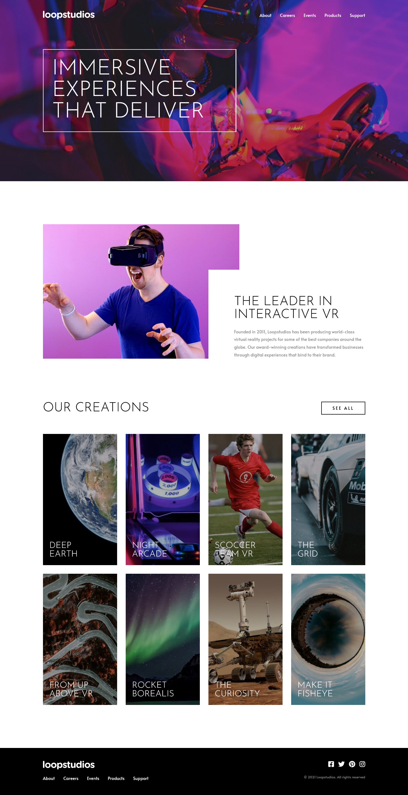

# Frontend Mentor - Loopstudios landing page solution

This is a solution to the [Loopstudios landing page challenge on Frontend Mentor](https://www.frontendmentor.io/challenges/loopstudios-landing-page-N88J5Onjw). Frontend Mentor challenges help you improve your coding skills by building realistic projects.

## Table of contents

- [Overview](#overview)
  - [The challenge](#the-challenge)
  - [Screenshot](#screenshot)
  - [Links](#links)
- [My process](#my-process)
  - [Built with](#built-with)
  - [What I learned](#what-i-learned)
  - [Continued development](#continued-development)
  - [Useful resources](#useful-resources)
- [Author](#author)
- [Acknowledgments](#acknowledgments)

## Overview

### The challenge

Users should be able to:

- View the optimal layout for the site depending on their device's screen size
- See hover states for all interactive elements on the page

### Screenshot

### Links

- Solution URL: [https://github.com/AshishShresth/landing-page-challenge.git]
- Live Site URL: [https://ashishshresth.github.io/landing-page-challenge]

## My process

### Built with

- Semantic HTML5 markup
- CSS custom properties
- Flexbox
- CSS Grid
- Mobile-first workflow

### What I learned

Through this challenge I have learned that responsive design can be a big challenge and it is very easy to complicate things if you aren’t careful, which I wasn’t. I used to use absolutely positioning to overlay content but, in this challenge, I used GRID which seemed confusing at first but with grid it was easier to make the site more responsive. I also learned to use flexbox and grid together.

### Continued development

While I used flexbox and grid in this challenge to make the layouts and make them responsive, I still need to learn to use them more efficiently and I need to work on writing and repeating less CSS. I have noticed that I am repeating a lot of the same CSS and complicating simple things. I want to focus on writing CSS more efficiently and use utility and component classes.

### Useful resources

- [CSS GRID](https://www.youtube.com/watch?v=rg7Fvvl3taU) - This video on css grid from Kevin Powell was really healful in understanding css grid.
- [overlaping content with css grid](https://www.youtube.com/watch?v=HFG3BKOqOlE) - This video also from Kevin Powell healped me to understand the concept of overlapping content with css grid.
- [Animated Hamburger Menu Tutorial](https://www.youtube.com/watch?v=dIyVTjJAkLw) - This video by codeSTACKr is a very good guide on animating a hamgurber menu.

## Author

- Frontend Mentor - [@AshishShresth](https://www.frontendmentor.io/profile/AshishShresth)

## Acknowledgments

The videos on CSS GRID by Kevin Powell were very helpful in completing this challenge and I have learned a lot from his content on youtube.
